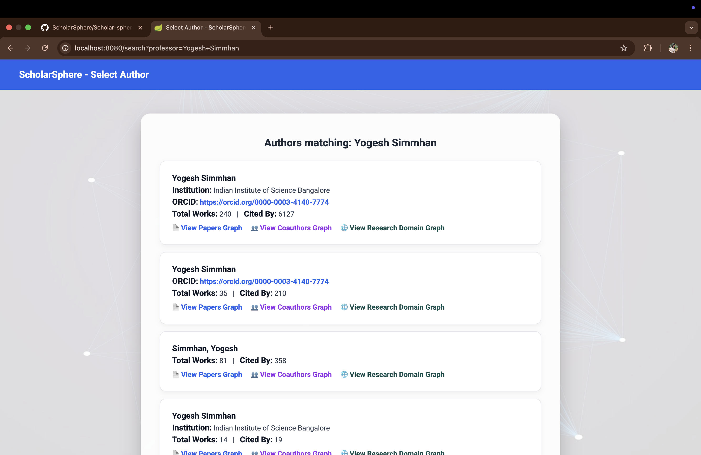
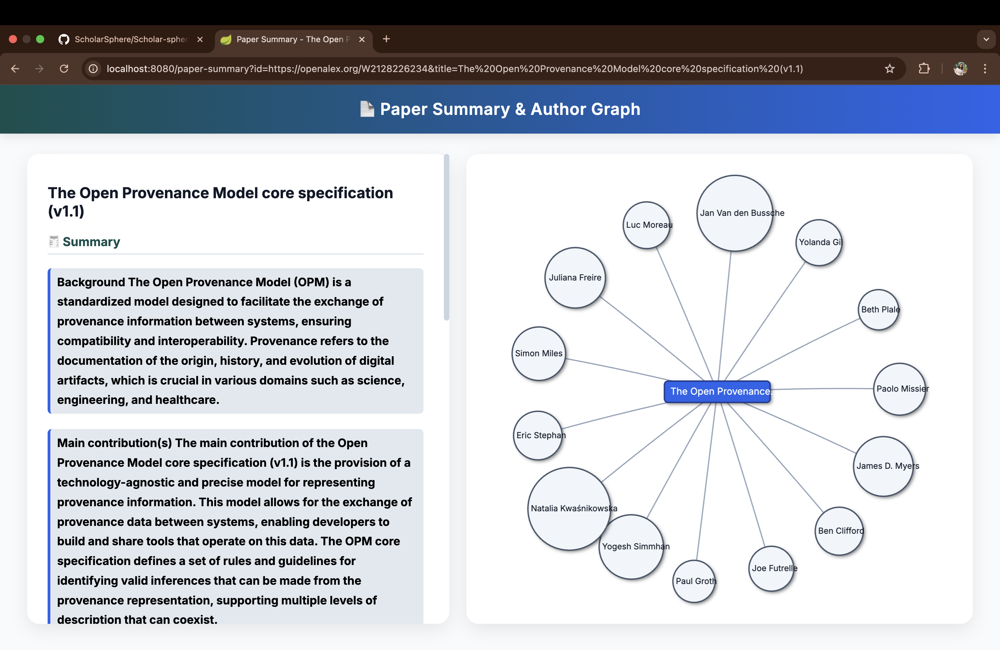
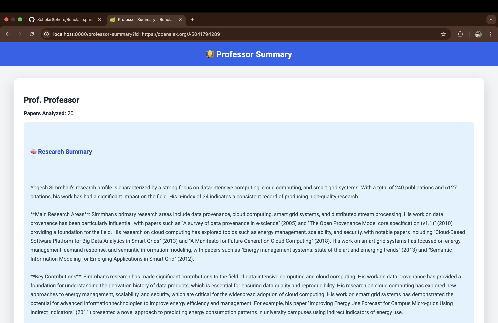
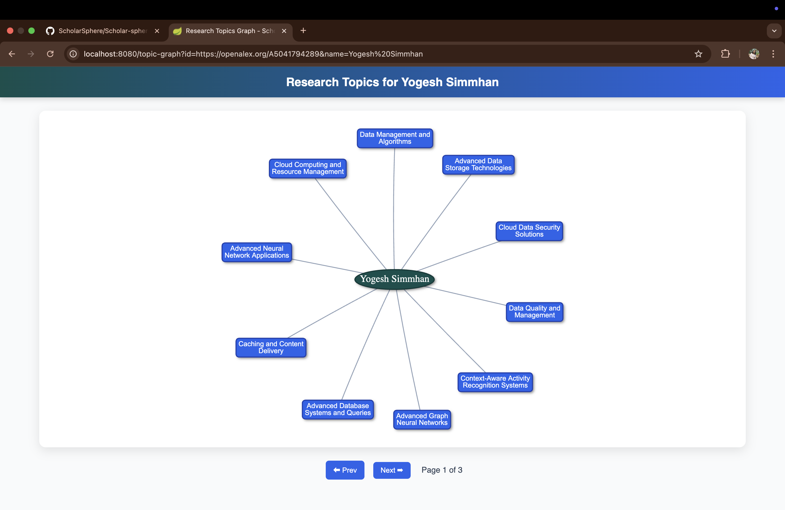

Scholar-Sphere — Installation & Architecture Guide


# 1. Overview

Scholar-Sphere is a microservices-based research analytics platform that aggregates academic data, generates graph-based relationships, and produces AI-generated summaries of authors and papers.

It combines Spring Boot, Python FastAPI, and Neo4j into a cohesive architecture — all orchestrated via Docker Compose.


It consists of the following components:

Scholar-sphere-latest/

│

├── Frontend-service/      → Spring Boot + Thymeleaf (UI)

├── Graph-service/         → Spring Boot + Neo4j backend

├── Summary-service/       → FastAPI (Python, LLM-powered summarization)

├── Scrappy-service/       → Go lang scraper for data ingestion

├── docker-compose.yml     → Multi-service orchestration

└── README.md / INSTALLATION.md


## 2. Technology Stack


###  Backend Services

| Service | Technology | Role |
|----------|-------------|------|
| **Graph Service** | Java (Spring Boot, Spring Data Neo4j) | Handles queries to the Neo4j knowledge graph |
| **Summary Service** | Python (FastAPI, Groq API, Neo4j driver) | Generates and caches LLM-based research summaries |
| **Scrappy Service** | Go (OpenAlex API) | Scrapes external data sources and populates Neo4j |
| **Frontend Service** | Java (Spring Boot + Thymeleaf) | Web UI for visualizing and browsing data |


###  Databases

| Database | Role | Connection |
|-----------|------|-------------|
| **Neo4j** | Stores authors, papers, relationships, and summaries | Bolt on port `7687`, HTTP on `7474` |
| **MySQL** | Stores user accounts and frontend metadata | JDBC on port `3306` |


###  Networking & Storage

| Type | Name | Purpose |
|------|------|----------|
| **Network** | `scholarsphere-net` | Shared bridge network for inter-container communication |
| **Volumes** | `neo4j-data`, `mysql-data` | Persistent data storage for databases |


## 3. Architecture Diagram
```
                   ┌────────────────────────┐
                   │       Frontend         │
                   │  (Spring Boot + Thyme) │
                   └──────────┬─────────────┘
                              │
                              ▼
               ┌────────────────────────────┐
               │        Graph Service       | 
               │  Spring Boot + Neo4j Driver| 
               └──────────────┬─────────────┘
                              │
                              ▼
               ┌─────────────────────────────┐
               │     Summarization Service   |
               │  FastAPI + LLM (Groq/OpenAI)|
               └──────────────┬──────────────┘
                              │
                              ▼
               ┌─────────────────────────────┐
               │       Neo4j Database        │
               │  (authors, papers, summary) │
               └─────────────────────────────┘
                              ▲
                              │
               ┌─────────────────────────────┐
               │       Scrappy Service       │
               │ go lang service for OpenAlex│
               └─────────────────────────────┘

```

## 4. Prerequisites

Before installation, ensure you have:

| **Tool** | **Minimum Version** | **Purpose** |
|-----------|---------------------|--------------|
| **Docker** | 20.10+ | Containerization |
| **Docker Compose** | v2+ | Multi-container orchestration |
| **Java** | 17+ | For Graph and Frontend services |
| **Python** | 3.10+ | For Scrappy and Summary services |
| **Groq/OpenAI API Key** | — | Needed for LLM summarization |


## 5. Environment Setup and running application

**Step 1 - Clone Repository**
```
  git clone https://github.com/Cloudforge2/ScholarSphere.git
  
  cd ScholarSphere/Scholar-sphere-latest
```


**Step 2 - Build and Start All Containers**

From the root project directory:
```
  docker-compose up --build
```
This will start:

| **Container** | **Description** | **Port** |
|----------------|------------------|-----------|
| **neo4j-scrappy** | Neo4j Graph Database | 7687 (Bolt), 7474 (HTTP) |
| **scholarsphere-mysql** | MySQL Database | 3306 |
| **scrappy** | Data scraper service | 8083 |
| **graph-service** | Neo4j-based Spring Boot API | 8082 |
| **frontend-service** | Web UI | 8080 |
| **summary-service** | LLM-powered summarizer | 8085 |

Step 3 - Access points:

| **Component** | **URL** |
|----------------|----------|
| **Frontend UI** | [http://localhost:8080](http://localhost:8080) |
| **Graph Service API** | [http://localhost:8082](http://localhost:8082) |
| **Scrappy API** | [http://localhost:8083](http://localhost:8083) |
| **Summary Service API** | [http://localhost:8085/professors/summary/by-id?id=https://openalex.org/A5041794289](http://localhost:8085/professors/summary/by-id?id=https://openalex.org/A5041794289) |
| **Neo4j Browser** | [http://localhost:7474](http://localhost:7474) |

```
Login credentials:

  Neo4j: neo4j / test123!

  MySQL: scholar_user / StrongPassword123!
```


## 6. Data Flow Summary

Scrappy-Service scrapes metadata from OpenAlex  and populates Neo4j.

Graph-Service exposes this graph through Spring Boot REST APIs.

Frontend-Service fetches data (authors, papers) and visualizes via Cytoscape.

Summary-Service:

  Fetches author’s top papers from Neo4j/OpenAlex

  Generates a research summary via LLM (Groq/OpenAI)

  Saves structured sections back to Neo4j

Cached results make subsequent summary requests and graph requests instant.


## 7. Logs and Debugging

You can view service logs live:
```
  docker compose logs -f summary-service
  docker compose logs -f graph-service
```
To stop all containers:
```
  docker compose down
```
To rebuild after making code changes:
```
  docker compose up --build --force-recreate
```
To check container health:
```
  docker ps
```


---

# Neo4j schema:

## 1. Overview

Scholar-Sphere uses Neo4j as its primary graph database to represent researchers, their publications, and their academic domains.
The schema models authors, their institutional affiliations, research fields, and topics of expertise, forming a rich interconnected academic knowledge graph.


## 2. Node Labels and Their Key Properties

| **Node Label** | **Purpose** | **Key Properties** |
|----------------|--------------|---------------------|
| **Author** | Represents an individual researcher | `id, displayName, displayNameAlternatives, orcid, worksCount, citedByCount, fullyIngested, lastFetched, updatedDate, researchSummary, publicationStatistics, collaborationPatterns, papersAnalyzedCount, papersSampleJson, lastUpdated` |
| **Institution** | Represents a university or research organization | `id, displayName, location, score, institutionIds` |
| **Work** | Represents an academic publication or paper | `id, title, doi, publicationYear, publicationDate, isRetracted, isOa, pdfUrl, citedByCount` |
| **Domain** | High-level research area (e.g., Computer Science, Physics) | `id, displayName, score` |
| **Field** | Subdivision of a domain (e.g., Software Engineering, Machine Learning) | `id, displayName, score` |
| **Subfield** | Finer-grained category within a field | `id, displayName, score` |
| **Topic** | Thematic keywords associated with works and authors (e.g., “Provenance”, “Edge Computing”) | `id, displayName, score` |
| **Venue** | Journal or conference where works are published | `id, displayName, score` |


## 3. Relationship Types and Meanings

| **Relationship Type** | **From → To** | **Meaning / Description** |
|------------------------|----------------|-----------------------------|
| `(:Author)-[:AUTHORED]->(:Work)` | Author → Work | Represents that an author wrote a paper. |
| `(:Author)-[:AFFILIATED_WITH]->(:Institution)` | Author → Institution | Indicates the author’s affiliation. |
| `(:Author)-[:HAS_TOPIC]->(:Topic)` | Author → Topic | Connects an author to the topics they frequently publish in. |
| `(:Work)-[:PUBLISHED_IN]->(:Venue)` | Work → Venue | The journal or conference where the work appeared. |
| `(:Work)-[:IS_ABOUT_TOPIC]->(:Topic)` | Work → Topic | Tags the paper with one or more research topics. |
| `(:Topic)-[:IN_SUBFIELD]->(:Subfield)` | Topic → Subfield | Hierarchical classification of topics. |
| `(:Subfield)-[:IN_FIELD]->(:Field)` | Subfield → Field | Subfield belongs to a specific field. |
| `(:Field)-[:IN_DOMAIN]->(:Domain)` | Field → Domain | Field belongs to a broader research domain. |


## 4. Graph Hierarchy Summary

The hierarchy of research areas and entities in the Scholar-Sphere graph looks like this:
```
(:Author)
   ├── [:AFFILIATED_WITH] → (:Institution)
   ├── [:AUTHORED] → (:Work)
    │          ├── [:PUBLISHED_IN] → (:Venue)
    │           └── [:IS_ABOUT_TOPIC] → (:Topic)
    └── [:HAS_TOPIC] → (:Topic)
(:Topic) → (:Subfield) → (:Field) → (:Domain)

```

## 5. Useful Queries for Exploration

Get All Authors with Summaries

```
  MATCH (a:Author)
  WHERE a.researchSummary IS NOT NULL
  RETURN a.displayName AS name, a.worksCount AS works, a.citedByCount AS citations
  ORDER BY citations DESC LIMIT 10;
```
List All Works by an Author
```
  MATCH (a:Author {id: ")
  RETURN w.title AS title, w.publicationYear AS year, w.citedByCount AS citations
  ORDER BY year DESC;
```
Author’s Affiliations
```
  MATCH (a:Author {id: ")
  RETURN i.displayName AS institution;
```
Topics Linked to an Author
```
  MATCH (a:Author {id: ")
  RETURN t.displayName AS topic, t.score ORDER BY t.score DESC LIMIT 10;
```
Co-Authors via Shared Papers
```
  MATCH (a1:Author {id: ")
  WHERE a1 <> a2
  RETURN DISTINCT a2.displayName AS coauthor, count(w) AS shared_papers
  ORDER BY shared_papers DESC LIMIT 10;
```
Domain Hierarchy Example
```
  MATCH (t:Topic {displayName: "Provenance"})-[:IN_SUBFIELD]->(s:Subfield)-[:IN_FIELD]->(f:Field)-[:IN_DOMAIN]->(d:Domain)
  RETURN t.displayName AS topic, s.displayName AS subfield, f.displayName AS field, d.displayName AS domain;
```


## 6. Schema Visualization

You can visualize the schema directly in Neo4j Browser using:
```
  CALL db.schema.visualization();
```
Or, if you want a text-based overview:
```
  MATCH (a)-[r]->(b)
  RETURN DISTINCT labels(a) AS from, type(r) AS rel_type, labels(b) AS to
  ORDER BY rel_type;
```


# Graph Service (Spring Boot + Neo4j)

## Overview

The Graph Service is a Spring Boot–based microservice responsible for interacting with the Neo4j Knowledge Graph.
It exposes REST endpoints to retrieve and query academic entities — professors, their authored papers, coauthors, topics, and institutional relationships — as a structured graph.

This service acts as the data backbone for Scholar-Sphere, enabling the frontend and summarization services to visualize and analyze research relationships.


## Technology Stack

| **Layer** | **Technology** | **Details** |
|------------|----------------|--------------|
| **Framework** | Spring Boot 3.x | Core application framework |
| **Database** | Neo4j 5.x | Graph database backend |
| **ORM** | Spring Data Neo4j | Object-graph mapping |
| **Language** | Java 17+ | Backend implementation language |
| **API Type** | RESTful (JSON) | Standard REST API communication |
| **Build Tool** | Maven / Docker | Project build and containerization |


Core Responsibilities

  Retrieve Author (Professor) entities and their authored works (papers) from Neo4j.

  Provide APIs to query coauthors, topics, and works by topic.

  Serve as the graph API gateway for visualization in the frontend.

  Decide whether a given author needs to be re-ingested (based on freshness and ingestion flags).


## Architecture Overview
```
+-----------------------------+
|      ScholarSphere UI       |
| (Frontend-Service / Thymeleaf)
+--------------+--------------+
               |
               v
     +----------------------+
     |   Graph Service      |
     | (Spring Boot + Neo4j)|
     +----------+-----------+
                |
                v
          +------------+
          |   Neo4j DB |
          +------------+
```


Data Model


## 🧩 Entities

| **Entity** | **Label** | **Key Properties** |
|-------------|------------|---------------------|
| **Professor** | Author | `id, displayName, orcid, worksCount, citedByCount, fullyIngested, lastFetched, updatedDate, lastKnownInstitution` |
| **Paper** | Work | `id, title, doi, publicationYear (optional)` |


## 📡 REST API — `/api/professors`

All endpoints are prefixed with:

/api/professors


| **Method** | **Endpoint** | **Description** |
|-------------|---------------|------------------|
| **GET** | `/{id}/graph` | Fetch a professor and their authored papers as a graph structure. |
| **GET** | `/by-name?name=<displayName>` | Find professors matching a given name. |
| **GET** | `/exists/{id}` | Check whether an author should be re-ingested (based on data age & ingestion status). |
| **GET** | `/paper/authors?id=<paperId>` | Get all authors for a given paper. |
| **GET** | `/coauthors?id=<authorId>` | Retrieve all coauthors of a given author. |
| **GET** | `/topics?id=<authorId>` | Fetch all topics associated with an author. |
| **GET** | `/papers/by-topic?id=<authorId>&topicName=<topic>` | Get all papers by an author within a specific topic. |


## Example Usage

Get Professor Graph 
```
  curl -X GET "http://localhost:8082/api/professors/https://openalex.org/A5041794289/graph" 
 ```

Get Coauthors 
```
  curl -X GET "http://localhost:8082/api/professors/coauthors?id=https://openalex.org/A5041794289" 
 
```
Get Topics by Author 
```
  curl -X GET "http://localhost:8082/api/professors/topics?id=https://openalex.org/A5041794289" 
 ```


## 🧱 Key Classes Overview

| **Component** | **Description** |
|----------------|------------------|
| **ProfessorController** | REST controller exposing all author- and work-related endpoints. |
| **ProfessorService** | Contains core business logic (data retrieval, freshness checks, filtering). |
| **ProfessorRepository** | Interface extending Neo4jRepository with custom Cypher queries. |
| **Professor** | Domain model representing an Author node. |
| **Paper** | Domain model representing a Work node. |


## Service Logic:

ProfessorService.shouldIngest()

  Determines whether an author’s data should be re-fetched and updated.
  The logic checks:

    Whether the author exists in Neo4j

    Whether they are marked as fullyIngested

    Whether their data is older than 15 days

  If any condition fails, the author is flagged for re-ingestion by Scrappy-Service.


## Environment Variables

| **Variable** | **Description** | **Example** |
|---------------|------------------|--------------|
| **NEO4J_URI** | Neo4j Bolt URI | `bolt://neo4j-scrappy:7687` |
| **NEO4J_USERNAME** | Neo4j username | `neo4j` |
| **NEO4J_PASSWORD** | Neo4j password | `test123!` |
| **SERVER_PORT** | Spring Boot port | `8082` |


## Docker Integration

This service is part of the Scholar-Sphere Docker Compose network.

In docker-compose.yml:
```
graph-service:
  build: ./Graph-service
  container_name: graph
  restart: unless-stopped
  environment:
    NEO4J_URI: bolt://neo4j-scrappy:7687
    NEO4J_USERNAME: neo4j
    NEO4J_PASSWORD: test123!
  ports:
    - "8082:8082"
  depends_on:
    neo4j:
      condition: service_healthy
  networks:
    - scholarsphere-net
```
Start command:
```
  docker-compose up --build graph-service
```

## Local Development Setup

Start Neo4j (via Docker Compose or standalone)
```
  docker-compose up -d neo4j
```
Run the Graph Service locally
```
  mvn spring-boot:run
```
Access endpoints
```
  http://localhost:8082/api/professors 
```


## Build & Test Commands

# Build the project
```
mvn clean package
```
# Run tests
```
mvn test
```


## 🔗 Integration Points

| **Service** | **Interaction Type** | **Description** |
|--------------|-----------------------|------------------|
| **Frontend-Service** | REST | Fetches authors, coauthors, topics, and papers for visualization. |
| **Scrappy-Service** | Async / API | Determines if authors require re-ingestion. |
| **Summary-Service** | Shared Neo4j DB | Uses the same Author nodes to attach LLM-generated summaries. |


---
# Scrappy
documentation is in the scrappy service directory. ty


# Frontend Service (Spring Boot + Thymeleaf)

## Overview

The Frontend Service is a Spring Boot–based web application that provides the user interface for Scholar-Sphere — an intelligent research exploration platform.
 It enables interactive visualization of professor networks, coauthor graphs, research topics, and summaries of academic papers, integrating multiple backend microservices seamlessly.

This service acts as the presentation layer of Scholar-Sphere, coordinating with:

  Graph Service for retrieving academic relationships from Neo4j,

  Scrappy Service for on-demand data ingestion, and

  Summary Service (FastAPI) for generating AI-driven research summaries.


# Core Responsibilities

  Serve the Scholar-Sphere web interface for exploring academic data.

  Render interactive graphs (professor, coauthor, topic, and paper networks).

  Fetch and display AI-generated summaries for authors and papers.

  Trigger data ingestion via Scrappy-Service when an author is missing or outdated.

  Integrate responses from multiple microservices into unified visualizations.


## Architecture Overview

ScholarSphere UI (Spring Boot + Thymeleaf)

│

┌───────────────┼────────────────┐

│               │                │

Graph Service    Scrappy Service   Summary Service

(Spring Boot + Neo4j)                             (FastAPI + LLM)

│               │                │

└───────────────┴────────────────┘
                |
        Neo4j Database

(Shared Knowledge Graph)

# Service Logic Highlights

Data Fetch Flow (Example: /professor-graph)

  User requests /professor-graph?id=<authorId>.

  Controller calls Graph Service /exists/{id} to check ingestion status.

  If author not found → triggers Scrappy ingestion (/fetch-author-by-id).

  Once available, calls Graph Service /{id}/graph.

  Builds Vis graph JSON (nodes + edges) and injects into Thymeleaf view.

Summarization Flow

  For professors: /professor-summary calls Summary Service /professors/summary/by-id.

  For papers: /paper-summary calls Summary Service /paper/by-id or /paper/by-title.

  Displays summarized results + related papers and authors.

Visualization

Graphs are dynamically rendered via Vis.js, with node color coding by type:

  Professor

  Paper

  Topic

  Coauthor


# Technology Stack

Framework: Spring Boot 3.x

  Provides a lightweight, production-ready Java framework for building the microservice.

View Engine: Thymeleaf

  Used for server-side rendering of HTML pages and integrating dynamic content.

Frontend Libraries: Vis.js

  Enables interactive graph visualization for professors, coauthors, topics, and papers.

Programming Language: Java 17+

  Modern, efficient, and compatible with Spring Boot 3.x features and syntax improvements.

Build Tool: Maven / Docker

  Maven used for project build, dependency management, and testing.

  Docker used for containerization and deployment in the Scholar-Sphere ecosystem.

Database: MySQL

  Used optionally for storing frontend-related metadata such as user data or session info.

API Type: MVC + REST (via RestTemplate)

  Follows the Model–View–Controller pattern.

  Uses RestTemplate to call backend microservices (Graph, Scrappy, and Summary).


# Docker Integration
```
frontend-service:
  platform: linux/amd64
  build: ./Frontend-service
  container_name: scholarsphere-frontend
  restart: unless-stopped
  environment:
    SPRING_DATASOURCE_URL: jdbc:mysql://scholarsphere-mysql:3306/scholarsphere_db?useSSL=false&serverTimezone=UTC&allowPublicKeyRetrieval=true
    SPRING_DATASOURCE_USERNAME: scholar_user
    SPRING_DATASOURCE_PASSWORD: StrongPassword123!
  ports:
    - "8080:8080"
  depends_on:
    mysql:
      condition: service_healthy
  networks:
    - scholarsphere-net

```


# Local Development Setup

# Start dependent containers
```
docker-compose up -d graph-service scrappy summary-service mysql
```
# Run frontend service locally
```
mvn spring-boot:run
```
# Access in browser

http://localhost:8080/

🧪 Build & Test


# Build the project
```
mvn clean package
```
# Run tests
```
mvn test
```


---

# Summary Service


A comprehensive research profiling and summarization system that aggregates data from multiple scholarly APIs, deduplicates abstracts and full texts, extracts content from PDFs, and generates detailed summaries using GroqCloud (LLaMA 3.3) (Primary LLM) , OpenAI GPT-4o-mini( Fallback Option) , Rule-based summarization (last fallback Option)

This tool allows you to search for an author by name or ORCID, fetch all their works from OpenAlex and related sources, and generate:

  Cleaned, deduplicated paper metadata

  Co-author networks

  Research statistics (citations, years active, collaborators)

  Full paper and author-level summaries (via LLMs)

  PDF-based content extraction (PyPDF2 / pdfplumber)


# Features

🔍 Fetches author & paper data from:

  OpenAlex

  arXiv

  Semantic Scholar

  Unpaywall

  Crossref

📑 Extracts full text from PDFs (if available)

🧹 Deduplicates overlapping abstracts from multiple sources

🧠 Summarizes research using:

  GroqCloud (LLaMA 3.3 70B) — primary LLM

  OpenAI GPT-4o-mini — fallback

  Rule-based summarization — last fallback

🧍 Displays co-authors, affiliations, and top collaborators

📈 Computes statistics:

  Publication velocity

  Citations and h-index

  Collaboration frequency

💾 Interactive or non-interactive execution modes


🚀 Installation

# 1. Clone the Repository
```

git clone cd <your-repo>
```
## 2. Set Up Python Environment
```
python3 -m venv venv
source venv/bin/activate   # on Windows: venv\Scripts\activate
```
## 3. Install Dependencies
```
pip install -r requirements.txt
```


🔑 API Keys Setup

This system uses both GroqCloud and OpenAI APIs.

# 1. Groq API Key (Recommended)

Get your API key from .

Then either:

  Option A: Set it as an environment variable:export GROQ_API_KEY="your_groq_api_key_here"

  Option B: Save it in ~/.groq_api_key

(the program can do this for you interactively on first run).

## 2. OpenAI API Key (Optional Fallback)

Get your OpenAI key from

Then:
```
export OPENAI_API_KEY="your_openai_api_key_here"

```

🧰 Usage

Run the system:
```
python kc_core.py
```

You’ll be prompted to search for an author:

Search by (1) Name or (2) ORCID? Enter 1 or 2:

Then follow interactive steps to:

  Select author (if multiple found)

  Choose how many papers to fetch

  View publication statistics and summaries

⚡ Example Workflow

  Run the script.

  Search author by name (e.g., "Yogesh Simmhan").

  Select the correct OpenAlex profile.

  The system:

    Fetches metadata from 5 APIs.

    Downloads open-access PDFs when available.

    Deduplicates content.

    Generates author and paper summaries.

    Prints publication stats and collaboration graphs.


📦 Outputs

Output of:

  Author profile

  Research summary

  Top collaborators

  Summarized paper list


🧩 Additional Features

| **Feature** | **How to Enable** |
|--------------|--------------------|
| **PDF text extraction** | Install `PyPDF2` and `pdfplumber` (already included in `requirements.txt`). |
| **Full author merging via ORCID** | Automatically enabled if multiple profiles share the same ORCID. |
| **Non-interactive mode** | Pipe default answers or run via `cron` / script. |


🧰 Tech Stack

Python 3.8+

aiohttp / asyncio — parallel I/O

requests — API calls

PyPDF2 / pdfplumber — PDF parsing

GroqCloud / OpenAI API — LLM summarization

OpenAlex, Crossref, Semantic Scholar, arXiv, Unpaywall APIs

📜 License

MIT License © 2025

### Screenshots

Below are screenshots of the main functionalities of our application.

<p align="center">
  <br>
  <em>Register page — for new users</em>
</p>

<p align="center">
  <br>
  <em>Login page — sign-in for users</em>
</p>

<p align="center">
  <br>
  <em>Dashboard — Search a professor by name</em>
</p>

<p align="center">
  <br>
  <em>shows all authors with matching name-- select one and type of graph you want to see</em>
</p>

<p align="center">
  <br>
  <em>Graph visualization page with author and his papers — interactive nodes and edges</em>
</p>

<p align="center">
  <br>
  <em>Click on paper node to get summary</em>
</p>

<p align="center">
  <br>
  <em>Click on professor node to get summary</em>
</p>

<p align="center">
  <br>
  <em>Graph visualization page with all research domains of professor — interactive nodes and edges</em>
</p>

<p align="center">
  <br>
  <em>Graph visualization page with all papers of professor in this research domain — interactive nodes and edges</em>
</p>

<p align="center">
  <br>
  <em>Graph visualization page with all coauthors of professor — interactive nodes and edges</em>
</p>


